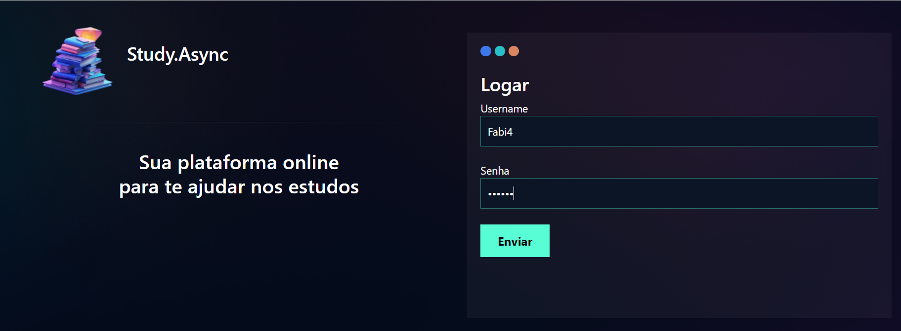

# Study Async

### O Projeto Study async é uma plataforma para ajudar estudantes(Ensino médio, fundamental, faculdade ...) ajudar durante seus estudos.
- Iniciando por um cadastro com login e senha
- Fazendo o Login terá acesso a apostila e flashcards
- podendo cadastrar perguntas de acordo com as respostas, categorias e o nivel de dificuldade
- Depois de responder todos os flashcards o usuário terá acesso a quantidade de erros, acertos e a quantidade que falta para responder, para depois o usuário ter acesso ao relatório detalhado.
- Tem acesso a todos os desafios que estiverem em abertos e até mesmo os que não foram finalizados
- Em seus acertos e erros terá um gráfico demonstrativo
- Acesso aos resumos e PDF. 

### Protótipos e layout

### Framework / biblioteca

* [Django](https://www.djangoproject.com/)

### Ferramentas utilizadas:

- [Python](https://www.python.org/)
- [Figma](https://www.figma.com);
